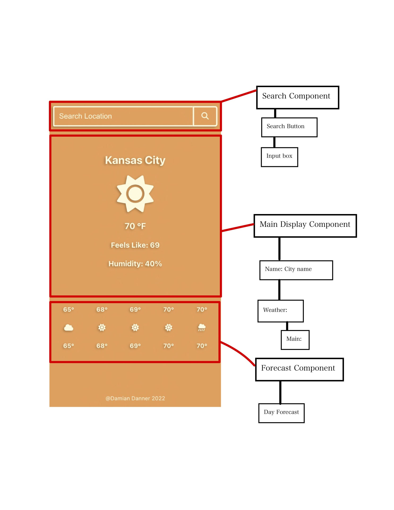

# Minimalist Weather App [V1 - Sept 12, 2022]

This minimalist weather app allows users to easily search locations and check the current weather and forecast for that area.

[Click here to use the application](https://weather-app-seven-ochre.vercel.app/)

## Project Description

This project is a front-end application built using **React.js** and **scss** while leveraging OpenWeatherMap's free api's for current weather as well the 5 day forecast. My main goal with this project was to increase my understanding of React's main concepts using class components while practicing retrieving data from an external API.

### `Component hierarchy and Design`

### `Build Details`
For more details on the steps towards building this project, including component logic and some of the blocker's I faced and how I solved them [click here to access my Notion Document](https://stripe-parade-9b5.notion.site/Weather-App-cf7c602efeae40fa9d6b6fe8b46256be)

### `npm start`

Runs the app in the development mode.\
Open [http://localhost:3000](http://localhost:3000) to view it in your browser.

The page will reload when you make changes.\
You may also see any lint errors in the console.
